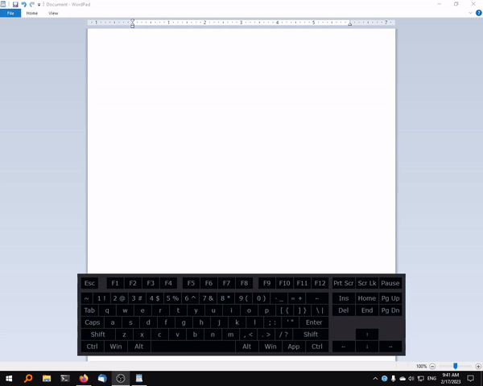

# ahk_on_screen_keyboard

A modular and customizable on-screen-keyboard for AutoHotkey projects.

## Features:
  * Displays physical and virtual keypresses
  * Can be controlled with dpad.
  * Includes light and dark mode
  * Easy to add or adjust layouts (in __New)

## Instructions:

To include in your script: `#Include osk.ahk`

To initialize object: `Global keyboard := new OSK("dark", "qwerty")`.

Main methods:
* `keyboard.toggle()` - Show and hide keyboard on the current monitor
* `keyboard.ChangeIndex(Direction)` - "Up", "Down", "Left", "Right"; For dpad navigation
* `keyboard.RetrieveDPadSelected()` - Returns the button currently highlighted by the dpad
* `keyboard.HandleOSKClick(key:="")` - Send the specified key through the keyboard

If you want to use an object name other than `keyboard` you will have to change the calls in the `#If` statements and the `HandleOSKClick()` function to your object's name.

## Testing:

If you run the script directly (rather than including it elsewhere) the following hotkeys will be activated to allow testing the keyboard.
* `Ctrl + Ins`: Toggle keyboard
* `Up`, `Down`, `Left`, `Right`: Change DPad index
* `Enter`: Send DPad selected

## Example

For an example implementation see [Controller_MKB](https://github.com/henrystern/controller_mkb).
